# loginProject

## 项目概述

项目使用组件版本：

Java_1.8 + MySql_8.0.23 + Tomcat_9.0.46

项目文件夹结构如图：

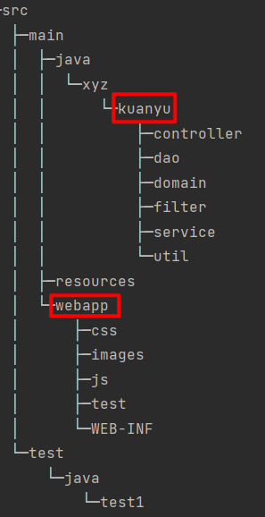

前端主要文件如下：

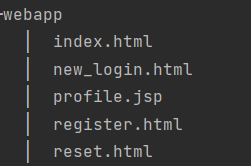

后端主要文件如下

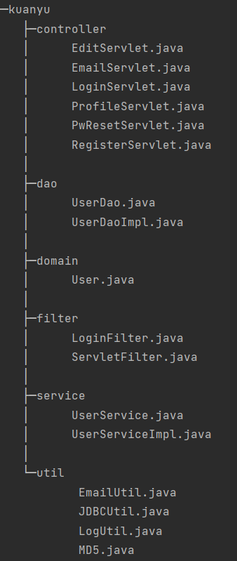

编程逻辑如下：

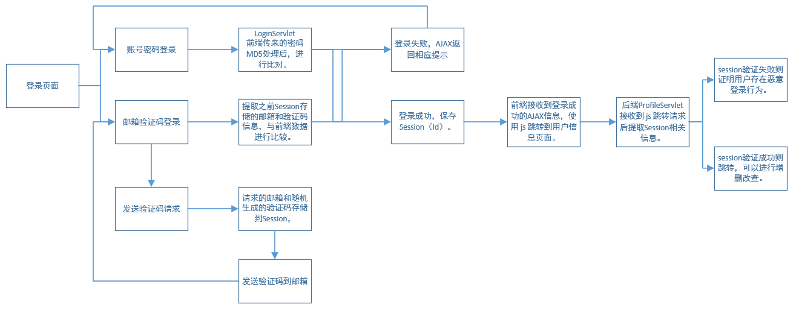

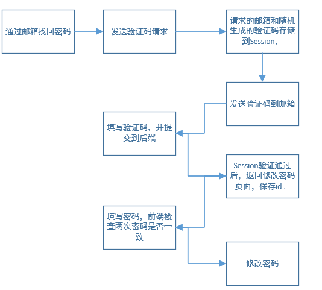

## 效果展示

### 账号密码登录

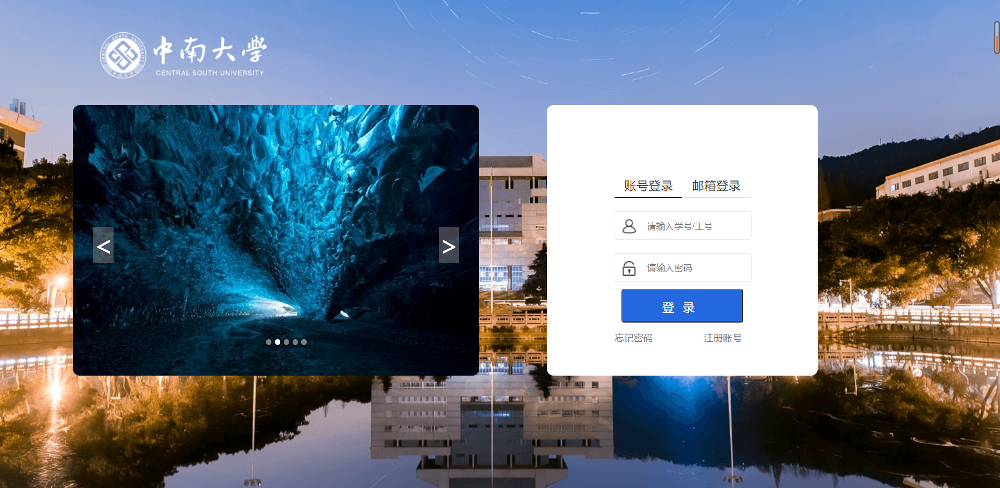

账号密码登录：

登陆后页面：

如果账号不存在：

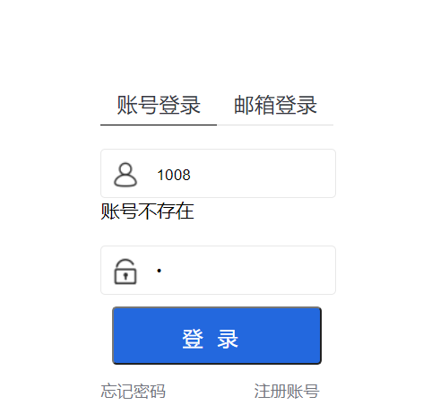

如果密码错误，也会返回相应提示

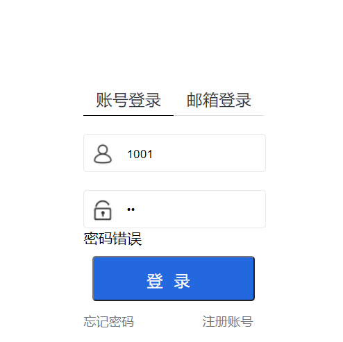

这两处小功能都是使用 Ajax 实现的，原理也比较简单

### 邮箱登录

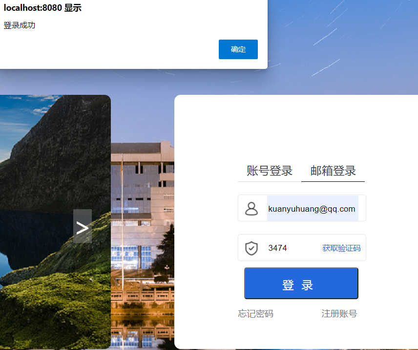

### 找回密码

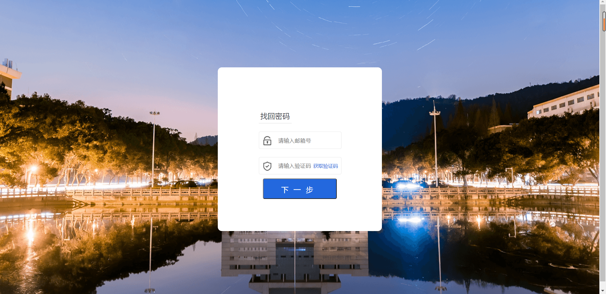

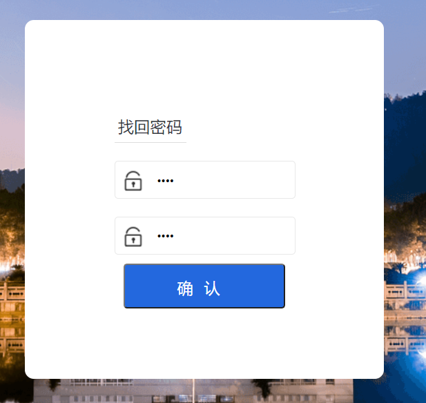

### 用户信息查看与修改

用户原有信息通过透明字体形式展现

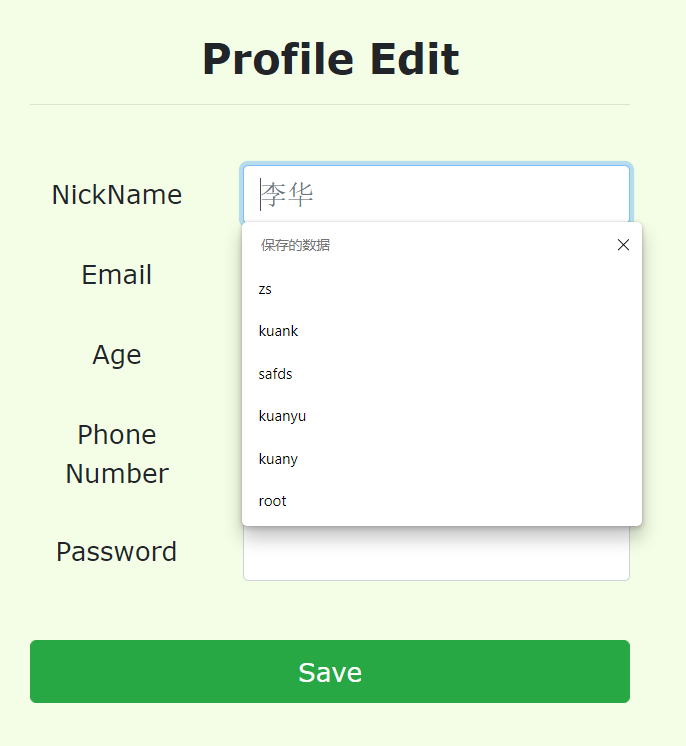

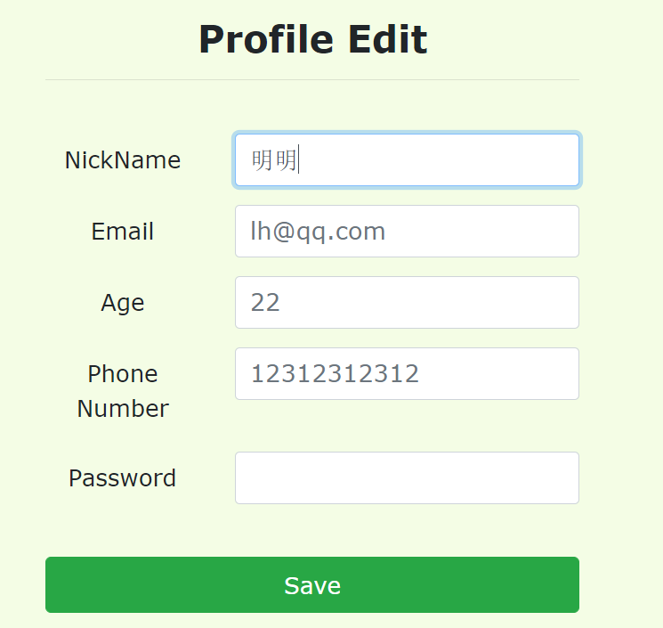

修改成功

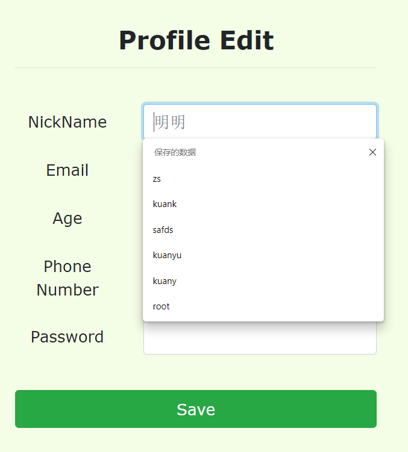

